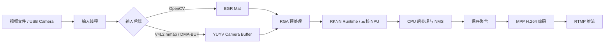

# RK3588 边缘视频流 AI 分析网关

基于 Orange Pi 5 Pro / RK3588 的边缘侧视频分析项目：从视频文件或 USB 摄像头采集图像，运行 INT8 量化的 YOLOv5s 检测，完成检测框绘制、MPP H.264 硬编码与 RTMP 推流。

## 架构



Camera 的 DMA-BUF 输入链路为：

```text
V4L2 DQBUF -> VIDIOC_EXPBUF -> camera_fd -> RGA YUYV->RGB/resize
-> RKNN rknn_create_mem_from_fd + rknn_set_io_mem -> NPU
```

输出侧的检测框目前仍由 OpenCV 在 CPU 上绘制；之后由 RGA 转换为 NV12，再交给 MPP 编码。

## 功能与运行模式

| 模式 | 行为 |
| --- | --- |
| `full` | 推理、画框、写 `output.avi`，并执行 MPP 路径 |
| `infer-only` | 输入、预处理、RKNN 推理、后处理，不编码输出 |
| `rknn-only` | 固定输入循环调用 RKNN，用于测试纯推理吞吐 |
| `mpp-only` | 推理、画框、RGA NV12 转换、MPP H.264 编码，不写 AVI、不推流 |
| `rtmp` | 在 `mpp-only` 基础上将 H.264 包封装为 FLV 并推送 RTMP |
| `snapshot` | 导出指定帧的检测结果图片 |

Camera 输入后端：

| 参数 | 路径 | 用途 |
| --- | --- | --- |
| `opencv` | Camera -> OpenCV BGR Mat -> RGA | 兼容旧路径 |
| `v4l2-mmap` | V4L2 mmap YUYV -> RGA virtual address -> RKNN copy | 公平性能 baseline |
| `dmabuf` | V4L2 YUYV -> DMA-BUF fd -> RGA fd -> RKNN fd | 降低 CPU 输入开销 |

## 编译与运行

在 `Desktop` 目录执行：

```bash
cmake -S . -B build -DCMAKE_BUILD_TYPE=Release
cmake --build build -j4

export LD_LIBRARY_PATH="$PWD/3rdparty/librknn_api/aarch64:$PWD/3rdparty/rga/RK3588/lib/Linux/aarch64:$LD_LIBRARY_PATH"
cd build
```

视频输入、MPP 编码：

```bash
./app --mode mpp-only --input video --video-path ../video.mp4 \
  --threads 6 --box-threshold 0.6 --nms-threshold 0.5 \
  --rknn-input-mode fd --rknn-output-mode copy --mpp-input-mode copy
```

USB 摄像头 DMA-BUF 输入：

```bash
V4L2_BUFFER_COUNT=8 ./app --mode mpp-only --input camera \
  --camera-id 0 --camera-width 640 --camera-height 480 \
  --camera-fps 30 --camera-format YUYV --threads 6 \
  --input-backend dmabuf --rknn-input-mode fd \
  --rknn-output-mode copy --mpp-input-mode copy
```

重新插拔摄像头后，设备节点可能从 `/dev/video0` 变化为 `/dev/video1`。运行前可用 `v4l2-ctl --list-devices` 确认并调整 `--camera-id`。

## DMA-BUF 优化

大尺寸图像帧在 Camera、RGA、RKNN、MPP 之间流转时，普通 CPU `memcpy` 会占用 CPU 时间并消耗 DDR 带宽。本项目使用 DMA-BUF fd 传递可被硬件访问的 buffer：

- Camera 通过 `VIDIOC_EXPBUF` 导出 V4L2 buffer 的 DMA-BUF fd；
- RGA 通过 `importbuffer_fd(camera_fd)` 直接读取 YUYV 原始帧；
- 640x640 RGB 模型输入由 dma-heap 分配，RKNN 通过 `rknn_create_mem_from_fd` 和 `rknn_set_io_mem` 预绑定；
- MPP 支持外部 NV12 DMA-BUF 作为编码输入；
- `FrameData` 持有 buffer 生命周期引用，worker 完成后才 QBUF 归还 Camera buffer。

这不是“CPU 完全不参与”，CPU 仍负责任务调度、cache sync、后处理和画框。优化目标是减少大块帧数据的 CPU 复制和重复输入设置。

## 性能结果

性能必须结合输入和输出条件理解：

| 场景 | 条件 | 结果 |
| --- | --- | --- |
| 纯 RKNN 吞吐 | 6 worker、三核 NPU、固定输入 | 约 111 FPS |
| 1080p 视频 + MPP | 视频文件输入、检测后 H.264 硬编码 | 约 62 FPS |
| 1080p 视频 + RTMP | 视频文件输入、H.264 编码与推流 | 约 56 FPS |
| Camera DMA-BUF + fd | 640x480 YUYV@30、6 worker、MPP-only、正常运行 | 端到端约 27.8 FPS |

Camera 端到端吞吐应以未挂 profiler 的正常运行数据为准。一次 600 帧复测中，OpenCV baseline 为 28.380 FPS，DMA-BUF + RKNN fd 为 27.840 FPS；两者吞吐接近。`perf stat` 下曾观测到约 14.8 FPS，这是分析工具与 V4L2 路径组合产生的扰动数据，仅用于观察 CPU 计数器，不作为正常性能结论。

在 `perf stat` 的公平对照中，`v4l2-mmap + RKNN copy` 与 `DMA-BUF + RKNN fd` 的每帧 CPU 工作量存在差异：DMA-BUF + fd 的 `task-clock` 降低约 11.3%、CPU cycles 降低约 10.7%、instructions 降低约 12.0%，并将逐帧 `rknn_input_set` 从约 1.0 ms 降至 0。该结果说明 DMA-BUF 主要降低 CPU 输入开销，而当前 Camera FPS 仍受采集 buffer 生命周期和完整输出链路约束。

完整的 perf 使用方法、计数器解释与调试过程见 [docs/RK3588_perf性能分析教学调试文档.md](docs/RK3588_perf性能分析教学调试文档.md)。

## 目录说明

```text
Desktop/
├── main.cpp                 # 命令行、输入/聚合/写线程编排
├── camera_dmabuf.*          # V4L2 mmap 与 Camera DMA-BUF 采集
├── frame_data.h             # 帧数据与 Camera buffer 生命周期
├── yolov5s.*                # RGA 预处理、RKNN 推理、后处理、画框
├── thread_poll.*            # 多 context worker 线程池
├── mpp.* / streamer.*       # MPP H.264 编码与 RTMP 输出
├── benchmark_stats.*        # 阶段耗时与 CSV 性能统计
├── debug_records/           # 本地运行日志、CSV、perf 数据，不提交
└── docs/                    # 调试与教学文档
```

---

# 代码问题深度讲解

## 在开始之前，先建立一个基本认知

你写了一个视频处理程序，它要做的事情很简单：把视频里的每一帧图像拿出来，用 AI 模型找出图里的物体，画上框，再把处理好的帧编码输出。

这个程序跑起来之后，你发现处理速度不够快，NPU 利用率只有 20%。我们花了一些时间分析原因，找到了几个问题。但在讲这些问题之前，需要先讲清楚程序里有哪些"角色"在工作，它们分别负责什么，否则后面的问题讲出来你也看不懂。

------

## 第一部分：程序里有哪些角色，它们怎么配合

想象一下一个流水线工厂，有三种工人：

**第一种：搬运工**（读线程） 专门从视频文件里一帧一帧读图片，读完放进一个传送带（读队列）。他不做任何处理，就是不停地读、放。

**第二种：AI 推理工（3个）**（worker 线程 × 3） 从传送带上拿图片，做两件事：先做预处理（调整尺寸、转换颜色格式），再交给 NPU 做推理（识别物体、画框）。做完放进另一条传送带（写队列）。这三个工人是并行的，同时在干活。

**第三种：编码工**（写线程） 从写队列拿处理好的帧，转成视频格式，推流出去。

这三种工人同时工作，互相配合，就像真正的流水线。

现在问题来了：三个 AI 推理工怎么知道该用哪个 AI 模型？程序里创建了三个模型实例，分别绑定在 RK3588 的三个 NPU 核心上。按理说应该是工人 0 固定用模型 0、工人 1 固定用模型 1、工人 2 固定用模型 2。

**但实际代码不是这么写的。** 这就是第一个问题。

------

## 第二部分：第一个问题——并发 Bug

### 先理解"并发"意味着什么

三个工人同时在干活。假设现在：

- 工人 0 正在处理第 0 帧
- 工人 1 正在处理第 1 帧
- 工人 2 正在处理第 2 帧

这时候第 3 帧来了，工人 0 处理完了，他去拿第 3 帧。

现在问题是：工人 0 应该用哪个模型实例处理第 3 帧？

### 代码里实际发生了什么

看 `thread_poll.cpp` 第 56 行，worker 函数一开始写了这样一行：

```cpp
std::shared_ptr<Yolov5s> yolo = yolo_group[id];  // worker 0 拿到模型0
```

看起来设计是：工人 0 固定拿模型 0，工人 1 固定拿模型 1。意图很好。

但是再看第 105 行，实际执行任务的 lambda 里写的是：

```cpp
auto yolo = yolo_group[index % yolo_group.size()];  // 按帧号选模型
```

注意：这里的 `index` 是**帧的编号**，不是 worker 的编号。

也就是说，第 56 行声明的 `yolo` **从来没有被用到**，它是死代码。真正执行推理的时候，用的是按帧号算出来的模型实例：

- 第 0 帧 → 模型 0
- 第 1 帧 → 模型 1
- 第 2 帧 → 模型 2
- 第 3 帧 → 模型 0（0 = 3 % 3）
- 第 4 帧 → 模型 1
- 第 5 帧 → 模型 2

### 这会造成什么后果

程序允许最多 10 帧同时在处理（`MAX_CONCURRENT_FRAMES = 10`）。这意味着第 0 帧和第 3 帧完全可能同时在被处理。

- 第 0 帧被工人 0 处理，选了**模型 0**
- 第 3 帧被工人 1 处理，也选了**模型 0**

两个工人同时在操作同一个模型实例。这个模型实例内部有一个 `rknn_context`（可以理解为 NPU 的操作句柄），两个人同时调用它的 `rknn_run()` 函数。

这就好比两个人同时往一台打印机发指令，而且这台打印机没有排队机制。结果是不可预测的：轻则推理结果错误（检测框乱跳），重则程序直接崩溃。

### 这个问题怎么解决

解决思路很简单：**让每个工人只用自己的模型，不用按帧号去抢**。

具体做法是改掉任务的设计方式。原来任务里自己选模型，改成：任务只带着帧数据，工人拿到任务后用自己专属的模型来处理。这样工人 0 永远只用模型 0，工人 1 永远只用模型 1，彻底没有竞争。

------

## 第三部分：第二个问题——每帧都在做本不必要的"搬家"工作

### 先理解 RGA 是什么

AI 模型要求输入图片必须是特定格式（RGB，640×640）。但视频帧是 BGR 格式，而且尺寸是原始视频的尺寸（比如 1920×1080）。所以在推理之前，需要做两件事：颜色格式转换（BGR→RGB）和缩放（1920×1080 → 640×640）。

这两件事如果用 CPU 做，要占大量 CPU 时间。RK3588 上有一个专门做图像处理的硬件单元叫 RGA（Raster Graphic Acceleration），可以把这两件事交给它做，速度快很多，CPU 可以去干别的。

### 使用 RGA 需要什么准备工作

RGA 是硬件，不能直接访问程序里普通的内存。使用它之前，需要先把内存"注册"给系统内核，告诉内核说"这块内存我要交给 RGA 用，帮我做 DMA 映射"。这个注册的操作就是 `importbuffer_virtualaddr`。

注册完之后 RGA 才能操作这块内存。用完之后要"注销"，把映射关系解除，这就是 `releasebuffer_handle`。

### 代码里实际发生了什么

看 `yolov5s.cpp` 第 209～227 行：

```cpp
// 每次调用 inference_image 都执行以下操作：

// 第一步：申请三块内存
src_buf     = (char *)malloc(...);   // 原图内存
src_cvt_buf = (char *)malloc(...);   // 颜色转换后的内存
dst_buf     = (char *)malloc(...);   // 缩放后的内存

// 第二步：把三块内存注册给内核（涉及内核态切换，开销大）
src_handle     = importbuffer_virtualaddr(src_buf,     ...);
src_cvt_handle = importbuffer_virtualaddr(src_cvt_buf, ...);
dst_handle     = importbuffer_virtualaddr(dst_buf,     ...);
```

然后在函数结束时（第 349～364 行）：

```cpp
// 注销三块内存
releasebuffer_handle(src_handle);
releasebuffer_handle(src_cvt_handle);
releasebuffer_handle(dst_handle);

// 释放三块内存
free(src_buf);
free(src_cvt_buf);
free(dst_buf);
```

每处理一帧图片，就做一次申请→注册→注销→释放。视频有多少帧，这个循环就重复多少次。

### 为什么这是问题

`importbuffer_virtualaddr` 不是普通的函数调用。它需要从用户程序切换到操作系统内核去执行（叫做"系统调用"），内核要锁定内存页、建立 DMA 映射表，完成后再切换回来。这个过程本身就需要时间，并且每帧做 3 次。

更关键的是：每帧处理的内存大小是固定的（视频分辨率固定，模型输入尺寸固定），没有任何理由要每帧重新申请再释放。这就像工厂每做一个零件，都要先去买一套工具，用完再卖掉。完全可以买一套工具一直用。

**解决方案**：在 Yolov5s 构造函数里申请并注册一次，之后每帧直接复用，析构时再释放。

------

## 第四部分：第三个问题——每帧都在向磁盘写调试图片

这个问题相对简单，但影响不小。

看 `yolov5s.cpp` 第 280～282 行：

```cpp
img_cvt = Mat(img_height, img_width, CV_8UC3, src_cvt_buf);
cv::imwrite("img_rga_cvt.jpg", img_cvt);   // 把颜色转换后的图写到磁盘

img_rga = Mat(resize_height, resize_width, CV_8UC3, dst_buf);
cv::imwrite("img_rga_rsz.jpg", img_rga);   // 把缩放后的图写到磁盘
```

这两行每帧都执行，把中间结果保存为 JPEG 文件。这显然是开发阶段用来检查 RGA 处理效果对不对的调试代码，正常运行时不需要。

**问题有两个：**

第一，写磁盘本身很慢。压缩一张 1080p 图片成 JPEG 需要几十毫秒，每帧都做，推理速度再快也会被这里拖死。

第二，3 个 worker 并发执行，它们都往同一个文件名 `img_rga_cvt.jpg` 写。三个线程同时写同一个文件，会发生文件内容混乱。

**解决方案**：直接删掉这两行。

------

## 第五部分：增加线程数的问题

### 先理解为什么增加线程可以提速

原来是 3 个 worker，每个 worker 的工作流程是串行的：先做预处理，等预处理完了再交给 NPU 推理，等 NPU 推理完了再做后处理。

在 NPU 推理的那段时间里，这个 worker 只是在等待。别的两个 worker 也在各自的流程里等。NPU 利用率低，根本原因就在这里——大量时间都花在 CPU 预处理上，NPU 只是偶尔被喂一次任务。

如果每个 NPU 核心有 2 个 worker，当 worker A 把任务交给 NPU 等结果的时候，worker B 可以同步在做下一帧的预处理。NPU 刚处理完 A 的任务，B 的任务立刻就准备好了，NPU 不需要空等。

### 增加线程数的前提条件

但增加线程数有一个大前提：**必须先修复并发 Bug**。

原来 3 个 worker 已经可能出现两个人抢同一个模型的情况。如果改成 6 个 worker，更多任务同时在途，抢同一个模型实例的概率大幅上升，Bug 触发的频率会显著增加。在 Bug 没修复之前增加线程数，等于在一个有漏洞的地基上加盖楼层，风险更大。

------

## 第六部分：关于 `%4` 的说明（之前我说错了）

在我们之前的讨论里，我说过"核心分配用了 `%4` 而不是 `%3`，是一个 bug"。经过重新核查代码，这个说法是错误的，需要纠正。

原因如下：

`yolov5s.cpp` 里确实写的是 `npu_index % 4`，但传进来的 `npu_index` 是多少，取决于 `thread_poll.cpp` 第 41 行：

```cpp
auto yolo = std::make_shared<Yolov5s>(model_path, i % 3);
```

这里传的是 `i % 3`，不是 `i`。所以无论创建多少个实例，`npu_index` 的值永远只有 0、1、2 这三种。把 0、1、2 分别代入 `% 4`，结果是 0、1、2，和用 `% 3` 完全一样。所以 `%4` 在这里不产生任何错误。

我之前把这个当成 bug 来讲是不对的，也因此花了不少篇幅解释一个不存在的问题，对此我需要说明清楚。

------

## 最后：四个问题的总结

| 问题                                                      | 代码位置                                | 严重程度            |
| --------------------------------------------------------- | --------------------------------------- | ------------------- |
| worker 声明的 yolo 从未使用，实际按帧号选模型导致并发冲突 | `thread_poll.cpp` 第 56 行 vs 第 105 行 | 高，可能崩溃        |
| 每帧重复 malloc + 内核注册 RGA 缓冲区                     | `yolov5s.cpp` 第 209～227 行            | 中，明显性能损耗    |
| 每帧写调试图片到磁盘，且多线程写同一文件                  | `yolov5s.cpp` 第 280、282 行            | 中，严重拖慢速度    |
| 线程数只有 3，NPU 大量时间空等                            | `main.cpp` 第 319 行                    | 中，需先修 Bug 再改 |
| `%4` 问题                                                 | —                                       | 不存在              |

