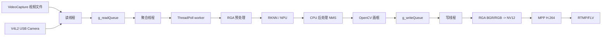

# 系统设计与架构

## 1. 目标与边界

系统在 RK3588 板端完成摄像头/视频帧采集、YOLOv5s 检测、画框、H.264 编码与 RTMP 输出。NPU 负责模型推理，RGA 负责图像格式和尺寸变换，MPP 负责视频编码；CPU 负责任务调度、后处理/NMS、画框、buffer 生命周期和网络封装。

## 2. 总体数据流



## 3. 线程模型与保序

- 读线程负责采集并将 `FrameData` 放入 `g_readQueue`；
- 聚合线程将帧提交至线程池，并维护 `frame_index -> future<ProcessResult>` 映射；
- 每个 worker 独占一个 `Yolov5s`/RKNN context，并按 worker 编号绑定三核 NPU；
- 聚合线程仅在 `nextWriteIndex` 的 future 就绪时将结果放入 `g_writeQueue`，因此输出帧顺序与输入一致；
- 写线程进行 NV12 转换、MPP 编码和可选 RTMP 推流。

`MAX_CONCURRENT_FRAMES` 约束在途任务数，避免读队列无限堆积。它提高吞吐，但也会影响端到端时延和 Camera V4L2 buffer 周转速度。

## 4. Camera 输入后端

### OpenCV 路径

```text
Camera YUYV -> OpenCV VideoCapture -> BGR Mat -> RGA -> RKNN copy
```

该路径用于旧逻辑兼容，可能将 YUYV 转为 BGR 后再转换为 RGB。

### V4L2 mmap baseline

```text
V4L2 mmap YUYV -> importbuffer_virtualaddr -> RGA -> RKNN copy
```

该路径不经过 OpenCV，用于拆分“去掉 OpenCV 转换”和“DMA-BUF/RKNN fd”两类优化收益。

### DMA-BUF + RKNN fd

```text
DQBUF -> VIDIOC_EXPBUF -> camera_fd -> importbuffer_fd
-> RGA YUYV->RGB/resize -> rknn_create_mem_from_fd
-> rknn_set_io_mem -> NPU
```

Camera buffer 的 fd 和索引由 `DmaBufFrameRef` 跟随 `FrameData` 在线程池中流转。worker 完成后引用释放，析构回调才执行 QBUF，将该 Camera buffer 归还驱动，避免 Camera 在推理期间覆盖原始帧。

## 5. DMA-BUF 内存对象

一个 fd 是用户态句柄，不是物理地址。不同阶段通常对应不同 buffer：

| Buffer | 内容 | 主要消费者 |
| --- | --- | --- |
| Camera buffer | 原始 YUYV | RGA |
| RKNN input buffer | 640x640 RGB | RKNN/NPU |
| MPP input buffer | 画框后的 NV12 | MPP encoder |

RGA 从源 buffer 读取后，需要将格式转换/resize 的结果写入新的目标 buffer；这不是 CPU memcpy。DMA-BUF 降低的是模块间传递大帧时的 CPU 搬运，不能消除 CPU 的后处理、画框和 cache sync。

## 6. 输出路径

当前画框采用 OpenCV `cv::Mat`。随后 RGA 将 BGR/RGB 转为 NV12；MPP 使用内部 buffer 或外部 DMA-BUF 进行 H.264 编码；RTMP 模式再通过 FFmpeg/RTMP 封装为 FLV 并发送到服务器。

## 7. 关键约束

- V4L2 buffer 数量必须覆盖在途帧数，否则 Camera 会因 buffer 未归还而降速；
- Camera 设备节点可能在重新插拔后变化；
- DMA buffer 在 CPU 和硬件之间共享时需注意 cache 一致性；
- `perf record` 可能显著扰动 Camera/V4L2 路径，热点分析不能直接当作端到端吞吐结果。
